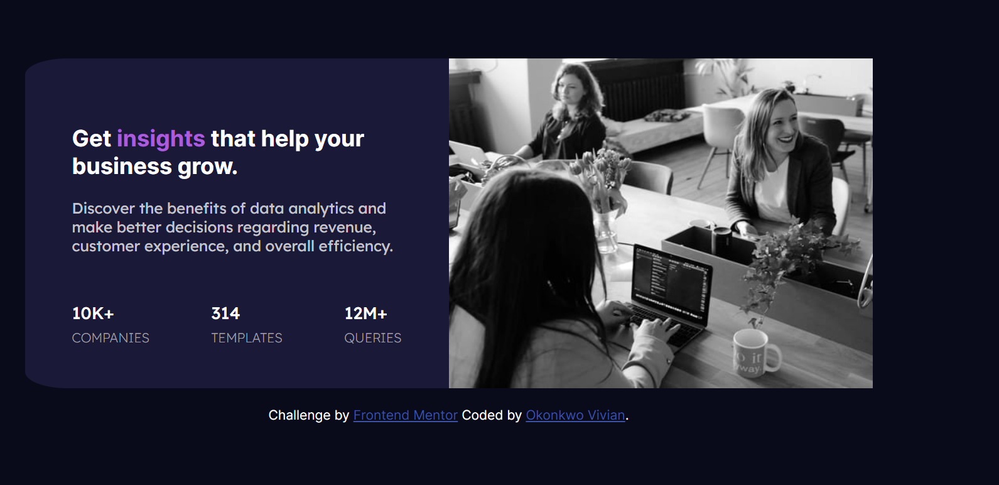
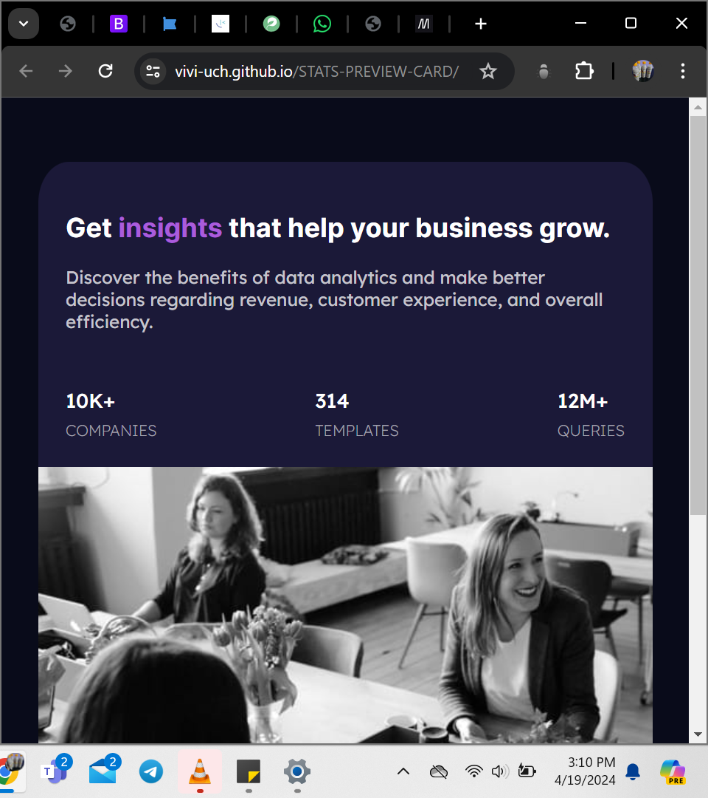

# Frontend Mentor - Stats preview card component solution

This is a solution to the [Stats preview card component challenge on Frontend Mentor](https://www.frontendmentor.io/challenges/stats-preview-card-component-8JqbgoU62). Frontend Mentor challenges help you improve your coding skills by building realistic projects. 

## Table of contents

- [Overview](#overview)
  - [The challenge](#the-challenge)
  - [Screenshot](#screenshot)
  - [Links](#links)
- [My process](#my-process)
  - [Built with](#built-with)
  - [What I learned](#what-i-learned)
  - [Useful resources](#useful-resources)

## Overview

### The challenge

Users should be able to:

- View the optimal layout depending on their device's screen size

### Screenshot




### Links

- Solution URL: https://github.com/vivi-uch/STATS-PREVIEW-CARD
- Live Site URL: https://vivi-uch.github.io/STATS-PREVIEW-CARD/

## My process

### Built with

- Semantic HTML5 markup
- CSS custom properties
- Flexbox
- @media

### What I learned
```css
/* This will distribute the three child divs equally within the container div, with equal margins between them */
.equal-space{
     display: flex;
     justify-content: space-between;
}

/* center an image */
img {
  display: block;
  margin-left: auto;
  margin-right: auto;
  width: 50%;
}

/* I learnt of a better way to center than margin: 0 auto; */
main{
    display: flex;
    justify-content: center;
    align-items: center;
    flex-direction: column;
}

/* Conversion from pixels to percentage and rem.
1px = 6.25%
1px = 0.06rem */

/* rems and percentage are relative but pixels are absolute.

responsive layouts with @media */
@media(max-width: width){
      .classname{
           changes in wifth, height or padding
   /*Note that felex-direction:column; stacks it vertically*/
       }
}
```

### Useful resources

- [Frontend Mentor](https://www.frontendmentor.io/home)
- [Udemy Angela Yu Web dev course](https://www.udemy.com/course/the-complete-web-development-bootcamp/)
- [ChatGPT](https://chat.openai.com/) 
- [W3school](https://www.w3schools.com/) 

## Author

- Linkeldn - [vivian okonkwo](https://www.linkedin.com/in/vivian-okonkwo-24b228253/)
- Frontend Mentor - [@okonks](https://www.frontendmentor.io/profile/okonks)
